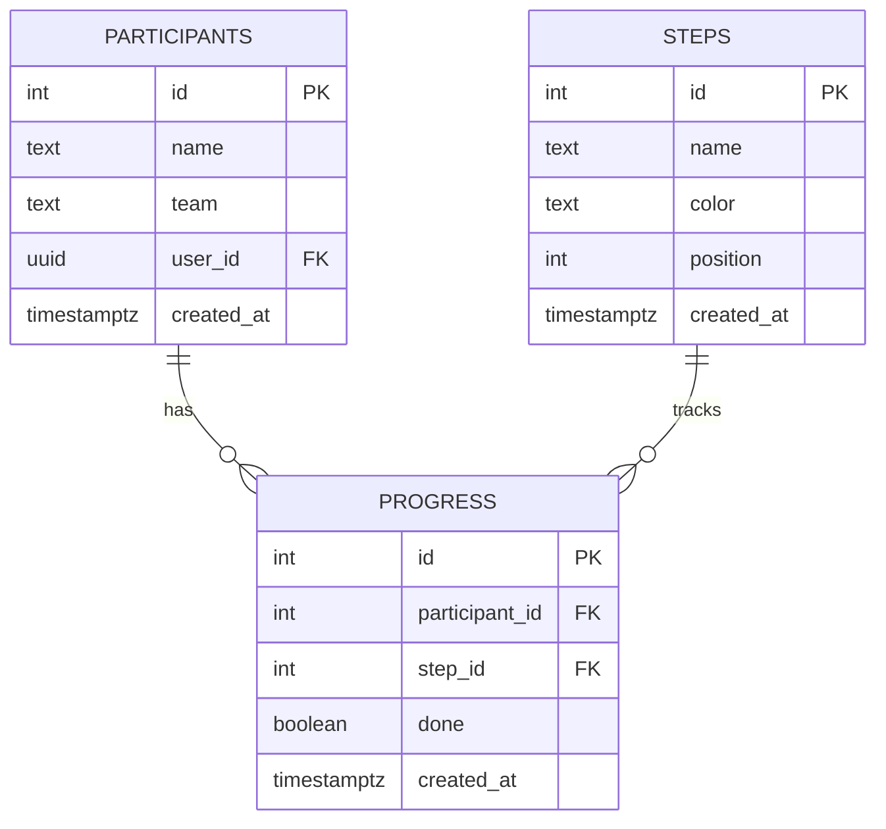

# PRD: Workshop Dashboard

## Problém
Organizátor workshopu na konferenci potřebuje real-time přehled o tom, jak si vedou jednotliví účastníci — kdo už má splněné které kroky. Na velkém screenu chce vidět matici účastníků × kroků, aby věděl kde kdo je a kdo potřebuje pomoc.

## Cílový uživatel
Organizátor workshopu (admin view + dashboard) a ~20 účastníků workshopu (později self-service označování kroků).

## User Stories
- Jako organizátor chci přidat/upravit/smazat účastníka, abych měl aktuální seznam
- Jako organizátor chci definovat kroky workshopu s barvou a pořadím, abych mohl strukturovat průběh
- Jako organizátor chci označit krok účastníka jako splněný/nesplněný, abych sledoval progres
- Jako organizátor chci vidět live dashboard (matice účastníci × kroky), abych měl přehled na velkém screenu
- Jako účastník chci později sám označit svůj krok jako hotový (self-service)

## MVP Scope

### In scope
- CRUD účastníků (jméno, tým)
- Definice kroků workshopu (název, barva, pořadí)
- Označení kroků jako splněný/nesplněný (admin)
- Live dashboard — matice všech účastníků × kroky (auto-refresh)
- Responzivní UI (Tailwind, mobile-first)

### Out of scope
- Účastníci si sami označují kroky (self-service)
- Přihlašování / auth
- Časové razítko dokončení kroků

## Datový model

### Tabulka: participants
| Sloupec | Typ | Popis |
|---------|-----|-------|
| id | integer generated always as identity | Primární klíč |
| name | text not null | Jméno účastníka |
| team | text | Tým / stůl (volitelné) |
| user_id | uuid references auth.users | Pro budoucí auth |
| created_at | timestamptz default now() | Datum vytvoření |

### Tabulka: steps
| Sloupec | Typ | Popis |
|---------|-----|-------|
| id | integer generated always as identity | Primární klíč |
| name | text not null | Název kroku |
| color | text not null default '#6B7280' | Barva kroku (hex) |
| position | integer not null | Pořadí zobrazení |
| created_at | timestamptz default now() | Datum vytvoření |

### Tabulka: progress
| Sloupec | Typ | Popis |
|---------|-----|-------|
| id | integer generated always as identity | Primární klíč |
| participant_id | integer references participants(id) on delete cascade | Účastník |
| step_id | integer references steps(id) on delete cascade | Krok |
| done | boolean not null default false | Splněno? |
| created_at | timestamptz default now() | Datum vytvoření |

## Diagram vztahů



## SQL pro Supabase

```sql
-- Tabulka účastníků
create table participants (
  id integer generated always as identity primary key,
  name text not null,
  team text,
  user_id uuid references auth.users,
  created_at timestamptz default now()
);

alter table participants enable row level security;
create policy "Allow all access to participants" on participants for all using (true) with check (true);

-- Tabulka kroků workshopu
create table steps (
  id integer generated always as identity primary key,
  name text not null,
  color text not null default '#6B7280',
  position integer not null,
  created_at timestamptz default now()
);

alter table steps enable row level security;
create policy "Allow all access to steps" on steps for all using (true) with check (true);

-- Tabulka progressu (průsečík účastník × krok)
create table progress (
  id integer generated always as identity primary key,
  participant_id integer not null references participants(id) on delete cascade,
  step_id integer not null references steps(id) on delete cascade,
  done boolean not null default false,
  created_at timestamptz default now(),
  unique(participant_id, step_id)
);

alter table progress enable row level security;
create policy "Allow all access to progress" on progress for all using (true) with check (true);
```
